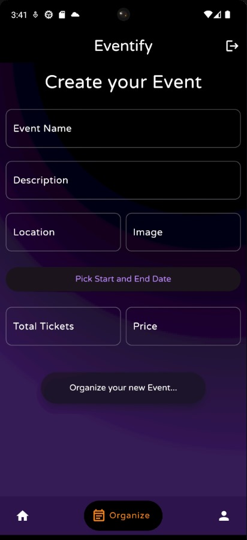

# Event Management Application with Blockchain Integration

This repository contains an event management application named EVENTIFY that leverages blockchain technology for secure ticket purchase and management. The application is built using Flutter for the user interface, Web3 for blockchain interaction, and Solidity for smart contract development.

## Features

1. Secure Ticket Purchase: Users can buy event tickets securely using blockchain transactions. Each ticket is uniquely identified and verified on the blockchain.

2. Decentralized Ownership: Tickets are owned by users directly on the blockchain, eliminating the need for intermediaries.

3. Anti-Counterfeit Measures: Blockchain ensures that tickets cannot be duplicated or forged.

4. Smart Contracts: The application uses Solidity smart contracts to manage ticket issuance, transfer, and validation.
## Prerequisites

1. Basic understanding of blockchain technology and Ethereum.

2. Familiarity with contracts and Ethereum addresses.
## System Requirements

Android device running Android 8.0 or above (11+ recommended).

## Screenshots

## Installation

Download the latest APK from the Releases page and install it. Eventify will download and install the latest APK for you as part of the setup process.
## Contribution

Contributions are welcome! If you’d like to contribute to this project, follow these steps:

1. Fork the repository.
2. Create a new branch for your feature or bug fix.
3. Make your changes and submit a pull request.

## Acknowledgments

1. Inspired by the decentralized future of event management.
2. Thanks to the Ethereum community and Solidity developers.
